# Oversikt over spørsmål per arbeidssituasjon

Kildegrunnlag: `SporsmalGenerator.kt` og oppsettfunksjonene i `soknadsopprettelse/*` i sykepengesoknad-backend.

## Visuell oversikt

```mermaid
flowchart TB
    S["Ny soknad"] --> A{"Arbeidssituasjon"}
    A --> AT["ARBEIDSTAKER"]
    A --> FR["FRILANSER"]
    A --> ND["NAERINGSDRIVENDE FISKER JORDBRUKER BARNEPASSER"]
    A --> AL["ARBEIDSLEDIG"]
    A --> AN["ANNET"]

    AT --> ATG["Grunn<br/>ANSVARSERKLARING<br/>TILBAKE_I_ARBEID og TILBAKE_NAR<br/>FERIE_V2 og FERIE_NAR_V2<br/>PERMISJON_V2 og PERMISJON_NAR_V2<br/>OPPHOLD_UTENFOR_EOS og OPPHOLD_UTENFOR_EOS_NAR<br/>TIL_SLUTT<br/>ANDRE_INNTEKTSKILDER_V2<br/>ARBEID_UNDERVEIS_100_PROSENT_prefix<br/>JOBBET_DU_GRADERT_prefix"]
    AT --> ATB["Betinget<br/>YRKESSKADE_V2<br/>NYTT_ARBEIDSFORHOLD_UNDERVEIS_prefix<br/>MEDLEMSKAP_prefix<br/>UTENLANDSK_SYKMELDING_prefix<br/>BRUKTE_REISETILSKUDDET"]

    FR --> FRG["Grunn<br/>ANSVARSERKLARING<br/>TILBAKE_I_ARBEID og TILBAKE_NAR<br/>ANDRE_INNTEKTSKILDER<br/>OPPHOLD_UTENFOR_EOS<br/>TIL_SLUTT<br/>ARBEID_UNDERVEIS_100_PROSENT_prefix<br/>JOBBET_DU_GRADERT_prefix"]
    FR --> FRB["Betinget<br/>ARBEID_UTENFOR_NORGE forste soknad i forlop<br/>UTENLANDSK_SYKMELDING_prefix<br/>BRUKTE_REISETILSKUDDET"]

    ND --> NDG["Grunn<br/>Som FRILANSER<br/>pluss NARINGSDRIVENDE_OPPRETTHOLDT_INNTEKT eller NARINGSDRIVENDE_OPPRETTHOLDT_INNTEKT_GRADERT"]
    ND --> NDB["Forste soknad i forlop<br/>NARINGSDRIVENDE_OPPHOLD_I_UTLANDET<br/>FRAVAR_FOR_SYKMELDINGEN_V2<br/>NARINGSDRIVENDE_VIRKSOMHETEN_AVVIKLET<br/>NARINGSDRIVENDE_NY_I_ARBEIDSLIVET<br/>NARINGSDRIVENDE_VARIG_ENDRING"]

    AL --> ALG["Grunn<br/>ANSVARSERKLARING<br/>ANDRE_INNTEKTSKILDER<br/>FRISKMELDT og FRISKMELDT_START<br/>OPPHOLD_UTENFOR_EOS<br/>TIL_SLUTT"]
    AL --> ALB["Betinget<br/>ARBEID_UTENFOR_NORGE forste soknad i forlop<br/>YRKESSKADE_V2<br/>UTENLANDSK_SYKMELDING_prefix<br/>BRUKTE_REISETILSKUDDET"]

    AN --> ANG["Grunn<br/>ANSVARSERKLARING<br/>ANDRE_INNTEKTSKILDER<br/>FRISKMELDT og FRISKMELDT_START<br/>PERMISJON_V2 og PERMISJON_NAR_V2<br/>OPPHOLD_UTENFOR_EOS<br/>TIL_SLUTT"]
    AN --> ANB["Betinget<br/>ARBEID_UTENFOR_NORGE forste soknad i forlop<br/>YRKESSKADE_V2<br/>UTENLANDSK_SYKMELDING_prefix<br/>BRUKTE_REISETILSKUDDET"]
```

| Arbeidssituasjon | Spørsmål som settes opp på nye søknader |
| --- | --- |
| `ARBEIDSTAKER` | `ANSVARSERKLARING`, `TILBAKE_I_ARBEID` (+ `TILBAKE_NAR`), `FERIE_V2` (+ `FERIE_NAR_V2`), `PERMISJON_V2` (+ `PERMISJON_NAR_V2`), `OPPHOLD_UTENFOR_EOS` (+ `OPPHOLD_UTENFOR_EOS_NAR`), `TIL_SLUTT`, `ANDRE_INNTEKTSKILDER_V2`, arbeid-underveis-spørsmål (`ARBEID_UNDERVEIS_100_PROSENT_*` / `JOBBET_DU_GRADERT_*`). |
| `ARBEIDSTAKER` (betinget) | `YRKESSKADE_V2` (når grunnlag finnes), `NYTT_ARBEIDSFORHOLD_UNDERVEIS_*` (når nye arbeidsforhold oppdages), medlemskapsspørsmål (`MEDLEMSKAP_*`) via LovMe, utenlandsk-sykmelding-spørsmål (`UTENLANDSK_SYKMELDING_*`) ved behov, `BRUKTE_REISETILSKUDDET` for `GRADERT_REISETILSKUDD`. |
| `FRILANSER` | `ANSVARSERKLARING`, `TILBAKE_I_ARBEID` (+ `TILBAKE_NAR`), `ANDRE_INNTEKTSKILDER`, `OPPHOLD_UTENFOR_EOS`, `TIL_SLUTT`, arbeid-underveis-spørsmål (`ARBEID_UNDERVEIS_100_PROSENT_*` / `JOBBET_DU_GRADERT_*`). |
| `FRILANSER` (betinget) | På første søknad i sykeforløpet: `ARBEID_UTENFOR_NORGE`. Ved behov: `UTENLANDSK_SYKMELDING_*`. For `GRADERT_REISETILSKUDD`: `BRUKTE_REISETILSKUDDET`. |
| `NAERINGSDRIVENDE`, `FISKER`, `JORDBRUKER`, `BARNEPASSER` | Samme grunnspørsmål som `FRILANSER`, pluss `NARINGSDRIVENDE_OPPRETTHOLDT_INNTEKT` eller `NARINGSDRIVENDE_OPPRETTHOLDT_INNTEKT_GRADERT`. |
| `NAERINGSDRIVENDE`, `FISKER`, `JORDBRUKER`, `BARNEPASSER` (første søknad i forløpet) | `NARINGSDRIVENDE_OPPHOLD_I_UTLANDET`, `FRAVAR_FOR_SYKMELDINGEN_V2`, `NARINGSDRIVENDE_VIRKSOMHETEN_AVVIKLET` (+ dato), ev. `NARINGSDRIVENDE_NY_I_ARBEIDSLIVET` (+ dato), `NARINGSDRIVENDE_VARIG_ENDRING` (+ detaljer). |
| `ARBEIDSLEDIG` | `ANSVARSERKLARING`, `ANDRE_INNTEKTSKILDER`, `FRISKMELDT` (+ `FRISKMELDT_START`), `OPPHOLD_UTENFOR_EOS`, `TIL_SLUTT`. |
| `ARBEIDSLEDIG` (betinget) | På første søknad i sykeforløpet: `ARBEID_UTENFOR_NORGE`. Ved behov: `YRKESSKADE_V2`, `UTENLANDSK_SYKMELDING_*`. For `GRADERT_REISETILSKUDD`: `BRUKTE_REISETILSKUDDET`. |
| `ANNET` | `ANSVARSERKLARING`, `ANDRE_INNTEKTSKILDER`, `FRISKMELDT` (+ `FRISKMELDT_START`), `PERMISJON_V2` (+ `PERMISJON_NAR_V2`), `OPPHOLD_UTENFOR_EOS`, `TIL_SLUTT`. |
| `ANNET` (betinget) | På første søknad i sykeforløpet: `ARBEID_UTENFOR_NORGE`. Ved behov: `YRKESSKADE_V2`, `UTENLANDSK_SYKMELDING_*`. For `GRADERT_REISETILSKUDD`: `BRUKTE_REISETILSKUDDET`. |

## Spørsmål vi fortsatt støtter, men som ikke settes opp på nye søknader

Disse håndteres fortsatt i prosessering/mapping/mutering for eldre søknader:

1. `FERIE`, `FERIE_NAR`, `PERMISJON`, `PERMISJON_NAR`, `UTLAND`, `UTLAND_NAR` (eldre V1-varianter, erstattet av V2-tagene i nye søknader).
2. `FRAVAR_FOR_SYKMELDINGEN`, `FRAVAR_FOR_SYKMELDINGEN_NAR` (eldre variant, erstattet av `FRAVAR_FOR_SYKMELDINGEN_V2`).
3. `YRKESSKADE` (eldre variant, nye søknader bruker `YRKESSKADE_V2`).
4. Eldre næringsdrivende-tagserie `INNTEKTSOPPLYSNINGER_*` (eksisterende søknader støttes fortsatt, og gamle spørsmål kan muteres over til nyere tagger).

## Tagg til spørsmålstekst

| Tagg | Spørsmålstekst |
| --- | --- |
| `ANSVARSERKLARING` | «Jeg bekrefter at jeg vil svare så riktig som jeg kan.» |
| `TILBAKE_I_ARBEID` | «Var du tilbake i fullt arbeid … i løpet av perioden …?» (arbeidsgiver/arbeidssituasjon settes dynamisk) |
| `TILBAKE_NAR` | «Når begynte du å jobbe igjen?» |
| `FERIE_V2` | «Tok du ut feriedager i tidsrommet …?» |
| `FERIE_NAR_V2` | «Når tok du ut feriedager?» |
| `PERMISJON_V2` | «Tok du permisjon mens du var sykmeldt …?» |
| `PERMISJON_NAR_V2` | «Når tok du permisjon?» |
| `OPPHOLD_UTENFOR_EOS` | «Var du på reise utenfor EU/EØS mens du var sykmeldt …?» |
| `OPPHOLD_UTENFOR_EOS_NAR` | «Når var du utenfor EU/EØS?» |
| `TIL_SLUTT` | Ingen eksplisitt spørsmålstekst (oppsummeringssteg). |
| `ANDRE_INNTEKTSKILDER_V2` | «Har du andre inntektskilder enn …?» |
| `ANDRE_INNTEKTSKILDER` | Variant av «Har du annen/andre inntektskilder …?» (avhenger av arbeidssituasjon) |
| `ARBEID_UNDERVEIS_100_PROSENT_*` | «… var du 100 % sykmeldt … Jobbet du noe i denne perioden?» |
| `JOBBET_DU_GRADERT_*` | «… kunne jobbe X %. Jobbet du mer enn det?» |
| `YRKESSKADE_V2` | «Skyldes dette sykefraværet en yrkesskade?» |
| `NYTT_ARBEIDSFORHOLD_UNDERVEIS_*` | «Har du jobbet noe hos … i perioden …?» |
| `NYTT_ARBEIDSFORHOLD_UNDERVEIS_BRUTTO_*` | «Hvor mye har du tjent i perioden …?» |
| `ARBEID_UTENFOR_NORGE` | «Har du arbeidet i utlandet i løpet av de siste 12 månedene?» |
| `FRISKMELDT` | «Brukte du hele sykmeldingen fram til …?» |
| `FRISKMELDT_START` | «Fra hvilken dato trengte du ikke lenger sykmeldingen?» |
| `BRUKTE_REISETILSKUDDET` | «Hadde du ekstra reiseutgifter mens du var sykmeldt?» |
| `NARINGSDRIVENDE_OPPRETTHOLDT_INNTEKT` | «Hadde du inntekt i virksomheten din selv om du var 100 % sykmeldt og ikke jobbet selv?» |
| `NARINGSDRIVENDE_OPPRETTHOLDT_INNTEKT_GRADERT` | «Hadde du inntekt i virksomheten din mens du var sykmeldt …, som ikke var et resultat av at du selv jobbet?» |
| `NARINGSDRIVENDE_OPPHOLD_I_UTLANDET` | «Har du vært i utlandet i løpet av de siste 12 månedene før du ble sykmeldt …?» |
| `FRAVAR_FOR_SYKMELDINGEN_V2` | «Var du borte fra jobb i fire uker eller mer rett før du ble sykmeldt …?» |
| `NARINGSDRIVENDE_VIRKSOMHETEN_AVVIKLET` | «Avviklet du virksomheten din før du ble sykmeldt …?» |
| `NARINGSDRIVENDE_VIRKSOMHETEN_AVVIKLET_DATO` | «Når avviklet du virksomheten din?» |
| `NARINGSDRIVENDE_NY_I_ARBEIDSLIVET` | «Har du blitt yrkesaktiv mellom … og frem til du ble sykmeldt …?» |
| `NARINGSDRIVENDE_NY_I_ARBEIDSLIVET_DATO` | «Når ble du yrkesaktiv?» |
| `NARINGSDRIVENDE_VARIG_ENDRING` | «Har det skjedd en varig endring i arbeidssituasjonen din mellom … og frem til du ble sykmeldt …?» |
| `NARINGSDRIVENDE_VARIG_ENDRING_TYPE` | «Hvilken varig endring har skjedd?» |
| `NARINGSDRIVENDE_VARIG_ENDRING_DATO` | «Når skjedde endringen?» |
| `MEDLEMSKAP_OPPHOLDSTILLATELSE_V2` | «Har Utlendingsdirektoratet gitt deg en oppholdstillatelse før …?» |
| `MEDLEMSKAP_UTFORT_ARBEID_UTENFOR_NORGE` | «Har du arbeidet utenfor Norge i løpet av de siste 12 månedene før du ble syk?» |
| `MEDLEMSKAP_OPPHOLD_UTENFOR_NORGE` | «Har du oppholdt deg i utlandet i løpet av de siste 12 månedene før du ble syk?» |
| `MEDLEMSKAP_OPPHOLD_UTENFOR_EOS` | «Har du oppholdt deg utenfor EU/EØS eller Sveits i løpet av de siste 12 månedene før du ble syk?» |
